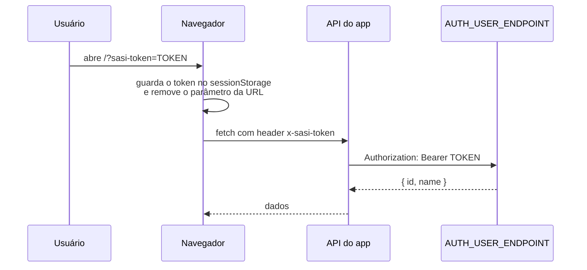

<div align="center">

# Checklist de Simulados · Atividades do CGC

Aplicação web da SASI para montar e acompanhar checklists de simulados, e para
gerenciar as atividades que chegam ao CGC pela API SASI.


</div>

---

## Sumário

- [Visão geral](#visão-geral)
- [Começando](#começando)
- [Variáveis de ambiente](#variáveis-de-ambiente)
- [Scripts](#scripts)
- [Docker](#docker)
- [Autenticação](#autenticação)
- [Estrutura do projeto](#estrutura-do-projeto)
- [Fluxo de trabalho](#fluxo-de-trabalho)

## Visão geral

Dois produtos convivem no mesmo app. Eles compartilham só o vocabulário de
status e o esquema de autenticação.

| Produto | Rotas | O que faz |
| --- | --- | --- |
| **Checklist de Simulados** | `/`, `/checklists`, `/admin`, `/history` | Atividades guardadas no Turso. O usuário cria checklists, marca status, comenta e consulta o histórico. |
| **Atividades do CGC** | `/atividades-cgc`, `/atividades-cgc/historico` | Espelho somente leitura das mensagens da API SASI (Bone), separadas por grupo (CGC, NUPPAE, NGOA, CIPA). Status, comentários e histórico ficam no banco local, porque o token da API não tem permissão de escrita. |
| **Controle** | `/controle` | Resumos dos checklists e das atividades finalizadas, com exportação em XLSX. A página não aparece em nenhum menu do app. |

**Status disponíveis:** `NAO_INICIADO`, `EM_ANDAMENTO` e `CONCLUIDO` aparecem
no seletor. `SEM_STATUS` e `IMPEDIDO` existem só para dados legados. Tudo é
definido em `src/lib/checklist-status.ts`.

## Começando

**Pré-requisitos:** Node.js 24, um banco no [Turso](https://turso.tech) e acesso
ao endpoint de autenticação da SASI.

```bash
# 1. Instale as dependências
npm install

# 2. Crie o .env.local a partir do exemplo e preencha os valores
cp .env.example .env.local

# 3. (Opcional) Popule o banco com as atividades iniciais
npm run db:seed

# 4. Suba o servidor de desenvolvimento
npm run dev
```

Na primeira visita, abra o app com o token na URL:

```
http://localhost:3000/?sasi-token=SEU_TOKEN
```

O app guarda o token na sessão e tira o parâmetro da barra de endereço. Para
detalhes, veja [Autenticação](#autenticação).

## Variáveis de ambiente

Coloque as variáveis no `.env.local` (fora do Git). Na Vercel, cadastre os
mesmos valores em *Settings → Environment Variables*.

### Obrigatórias

| Variável | Para que serve |
| --- | --- |
| `TURSO_DATABASE_URL` | URL do banco libSQL (`libsql://...turso.io`) |
| `TURSO_AUTH_TOKEN` | Token de acesso ao banco |
| `AUTH_USER_ENDPOINT` | Endpoint que valida o `sasi-token`. Recebe `Authorization: Bearer <token>` e retorna um usuário com `id` e `name`. **Sem essa variável, o app recusa todo token, inclusive em localhost.** |
| `SASI_API_TOKEN` | Token de provedor da API SASI (`pat_`, escopo `READ_MESSAGES`), usado pelas Atividades do CGC |

### Opcionais

| Variável | Padrão | Para que serve |
| --- | --- | --- |
| `SASI_API_BASE_URL` | `https://api.bone.sasi.io` | Base da API SASI |
| `SASI_API_TIMEOUT_MS` | `15000` | Timeout das chamadas à API SASI |
| `SASI_CGC_SCAN_CAP` | `500` | Máximo de mensagens que o servidor varre por consulta |
| `SASI_CGC_FIELD_GROUP` | `selecione_time` | Campo do formulário que define o grupo |
| `SASI_CGC_FIELD_PRIORITY` | `prioridades` | Campo de prioridade |
| `SASI_CGC_FIELD_DEADLINE` | `prazo_de_entrega` | Campo de prazo |
| `SASI_CGC_FIELD_DESCRIPTION` | `descreva` | Campo de descrição |
| `CGC_CRON_SECRET` | — | Protege `/api/cgc/cron-sync`, chamada pelo GitHub Actions |
| `CGC_WEBHOOK_SECRET` | — | Protege `/api/cgc/webhook`, chamada pelo painel do SASI |
| `SASI_NOTIFY_TOKEN` | — | Ativa o push de atividades do CGC novas ou concluídas. Sem ele, o envio fica desligado. |
| `SASI_NOTIFY_API_BASE_URL` | `https://api.sasi.io` | Base da API de notificação |
| `SASI_NOTIFY_SUBSCRIPTION_KEY` | `app:1619` | Inscrição que recebe o push |

> **Atenção:** nenhuma variável usa o prefixo `NEXT_PUBLIC_`, e isso é de
> propósito. Nenhum segredo chega ao navegador.

## Scripts

| Comando | O que faz |
| --- | --- |
| `npm run dev` | Servidor de desenvolvimento (`next dev`) |
| `npm run build` | Build de produção |
| `npm run start` | Sobe o build de produção |
| `npm run lint` | ESLint em todo o projeto |
| `npm run db:seed` | Popula as atividades no Turso. Usa o mesmo `.env.local` do app. |

Não há suíte de testes. Antes de abrir uma PR, rode `npm run lint` e
`npm run build`.

## Docker

O `docker-compose.yml` tem dois perfis, e os dois leem o `.env.local`:

```bash
# Desenvolvimento com hot-reload
docker compose --profile dev up

# Build de produção
docker compose --profile prod up --build
```

## Autenticação



- O token só é lido de `?sasi-token=`, e só no primeiro acesso. Depois disso,
  ele viaja no header `x-sasi-token`.
- Parâmetro ausente, com outro nome ou vazio significa usuário sem acesso.
- **Não existe bypass para localhost.** Localmente, o app se comporta igual à
  produção.
- Ao fechar a aba, o acesso se perde. Para voltar, o usuário precisa abrir um
  novo link com `?sasi-token=`.

## Estrutura do projeto

```
src/
├── app/                  # Rotas (App Router) — toda página é client component
│   ├── api/              # Route handlers: checklists, activities, cgc/*, controle/*
│   ├── atividades-cgc/   # Atividades do CGC e histórico
│   ├── checklists/       # Lista de checklists
│   ├── admin/            # Edição de atividades e categorias
│   ├── history/          # Histórico do checklist
│   ├── controle/         # Painel de resumos + exportação XLSX
│   └── globals.css       # Todas as regras responsivas
├── hooks/useSasiToken.ts # Leitura do token no cliente
└── lib/
    ├── db.ts             # Cliente Turso + initDb() (criação e migração das tabelas)
    ├── token.ts          # Fonte única das regras do token
    ├── auth.ts           # Validação contra AUTH_USER_ENDPOINT
    ├── checklist-status.ts
    ├── sasi-api/         # Única camada de rede com a API SASI
    └── cgc/              # Mapeamento de campos, cache e totais por grupo
```

Para decisões de arquitetura e limitações da API SASI, veja o
[`CLAUDE.md`](CLAUDE.md).

## Fluxo de trabalho

- `main` e `develop` são as únicas branches permanentes.
- Toda mudança nasce numa branch a partir de `develop`, com o nome
  `FIX/<descricao-em-ingles>` (por exemplo, `FIX/add-lucide-icons`).
- A mudança entra em `develop` por pull request, com uma seção `## Summary`.
- `develop` é promovida para `main` num passo separado.
