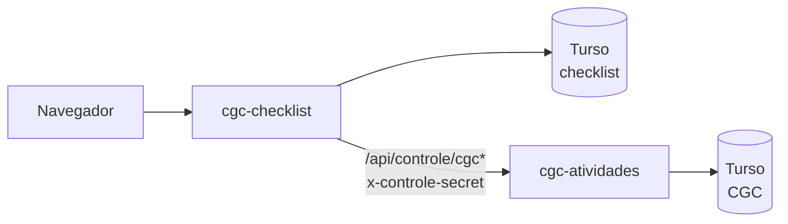
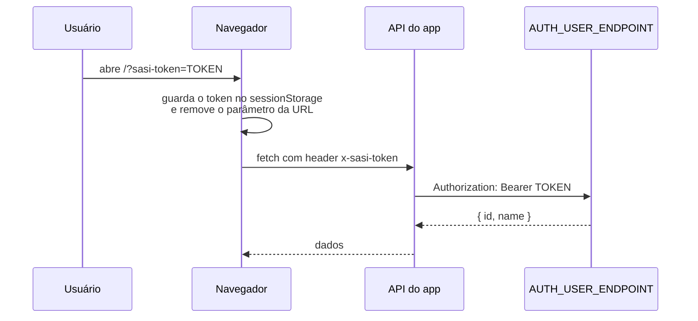

<div align="center">

# Checklist de Simulados

Aplicação web da SASI para montar, acompanhar e registrar checklists de
simulados.


</div>

---

## Sumário

- [Visão geral](#visão-geral)
- [Começando](#começando)
- [Variáveis de ambiente](#variáveis-de-ambiente)
- [Scripts](#scripts)
- [Docker](#docker)
- [Autenticação](#autenticação)
- [Estrutura do projeto](#estrutura-do-projeto)
- [Fluxo de trabalho](#fluxo-de-trabalho)

## Visão geral

| Tela | Rota | O que faz |
| --- | --- | --- |
| **Checklist** | `/` | O checklist do simulado: o usuário marca status e comenta cada atividade. |
| **Checklists** | `/checklists` | Lista dos checklists, com criação e exportação em XLSX. |
| **Admin** | `/admin` | Edição das atividades e categorias. |
| **Histórico** | `/history` | Todas as mudanças de status e os comentários. |
| **Controle** | `/controle` | Resumos dos checklists e das atividades do CGC finalizadas, com exportação em XLSX. A página não aparece em nenhum menu do app. |

**Status disponíveis:** `NAO_INICIADO`, `EM_ANDAMENTO` e `CONCLUIDO` aparecem
no seletor. `SEM_STATUS` e `IMPEDIDO` existem só para dados legados. Tudo é
definido em `src/lib/checklist-status.ts`.

> **Atividades do CGC** ficam em outro repositório,
> [`cgc-atividades`](https://github.com/vinymarotzki/cgc-atividades). Este app
> só lê os dados dele, por proxy, para montar o `/controle`.



## Começando

**Pré-requisitos:** Node.js 24, um banco no [Turso](https://turso.tech) e acesso
ao endpoint de autenticação da SASI. Para o `/controle` mostrar os dados do CGC,
o `cgc-atividades` precisa estar rodando (localmente, na porta `3001`).

```bash
# 1. Instale as dependências
npm install

# 2. Crie o .env.local na raiz com as variáveis da seção "Variáveis de
#    ambiente" abaixo (não há arquivo de exemplo)

# 3. (Opcional) Popule o banco com as atividades iniciais
npm run db:seed

# 4. Suba o servidor de desenvolvimento
npm run dev
```

Na primeira visita, abra o app com o token na URL:

```
http://localhost:3000/?sasi-token=SEU_TOKEN
```

O app guarda o token na sessão e tira o parâmetro da barra de endereço. Para
detalhes, veja [Autenticação](#autenticação).

## Variáveis de ambiente

Coloque as variáveis no `.env.local` (fora do Git). Na Vercel, cadastre os
mesmos valores em *Settings → Environment Variables*.

| Variável | Para que serve |
| --- | --- |
| `TURSO_DATABASE_URL` | URL do banco libSQL (`libsql://...turso.io`) |
| `TURSO_AUTH_TOKEN` | Token de acesso ao banco |
| `AUTH_USER_ENDPOINT` | Endpoint que valida o `sasi-token`. Recebe `Authorization: Bearer <token>` e retorna um usuário com `id` e `name`. **Sem essa variável, o app recusa todo token, inclusive em localhost.** |
| `CGC_APP_URL` | URL do `cgc-atividades`, usada pelo proxy do `/controle` (local: `http://localhost:3001`) |
| `CONTROLE_PROXY_SECRET` | Segredo compartilhado com o `cgc-atividades`, enviado no header `x-controle-secret`. Os dois apps precisam do mesmo valor. Sem ele, o proxy responde 500 em vez de chamar o outro app sem credencial. |

> **Atenção:** nenhuma variável usa o prefixo `NEXT_PUBLIC_`, e isso é de
> propósito. Nenhum segredo chega ao navegador.

## Scripts

| Comando | O que faz |
| --- | --- |
| `npm run dev` | Servidor de desenvolvimento (`next dev`) |
| `npm run build` | Build de produção |
| `npm run start` | Sobe o build de produção |
| `npm run lint` | ESLint em todo o projeto |
| `npm run db:seed` | Popula as atividades no Turso. Usa o mesmo `.env.local` do app. |

Não há suíte de testes. Antes de abrir uma PR, rode `npm run lint` e
`npm run build`.

<details>
<summary><strong>Migração dos dados do CGC (só uma vez)</strong></summary>

`scripts/migrate-cgc-data.mjs` copia as tabelas `cgc_*` deste banco para o banco
do `cgc-atividades`. Ele usa `INSERT OR REPLACE`, então rodar de novo não duplica
linhas.

```bash
SOURCE_TURSO_DATABASE_URL=... SOURCE_TURSO_AUTH_TOKEN=... \
DEST_TURSO_DATABASE_URL=...   DEST_TURSO_AUTH_TOKEN=...   \
node scripts/migrate-cgc-data.mjs --dry-run
```

Para gravar de verdade, rode o mesmo comando sem `--dry-run`.

</details>

## Docker

O `docker-compose.yml` tem dois perfis, e os dois leem o `.env.local`:

```bash
# Desenvolvimento com hot-reload
docker compose --profile dev up

# Build de produção
docker compose --profile prod up --build
```

No perfil `dev`, o `CGC_APP_URL` vira `http://host.docker.internal:3001`, para
o container alcançar o `cgc-atividades` que roda no host. Esse valor tem
precedência sobre o `.env.local`.

## Autenticação



- O token só é lido de `?sasi-token=`, e só no primeiro acesso. Depois disso,
  ele viaja no header `x-sasi-token`.
- Parâmetro ausente, com outro nome ou vazio significa usuário sem acesso.
- **Não existe bypass para localhost.** Localmente, o app se comporta igual à
  produção.
- Ao fechar a aba, o acesso se perde. Para voltar, o usuário precisa abrir um
  novo link com `?sasi-token=`.

## Estrutura do projeto

```
src/
├── app/                    # Rotas (App Router) — toda página é client component
│   ├── page.tsx            # Checklist
│   ├── checklists/         # Lista de checklists
│   ├── admin/              # Edição de atividades e categorias
│   ├── history/            # Histórico
│   ├── controle/           # Resumos + exportação XLSX
│   ├── api/                # activities, checklists, history, observations, controle/*
│   └── globals.css         # Todas as regras responsivas
├── components/             # LoadingScreen e componentes de UI (shadcn)
├── hooks/useSasiToken.ts   # Leitura do token no cliente
└── lib/
    ├── db.ts               # Cliente Turso + initDb() (criação e migração das tabelas)
    ├── token.ts            # Fonte única das regras do token
    ├── auth.ts             # Validação contra AUTH_USER_ENDPOINT
    ├── checklist-status.ts # Status e cores
    └── seed.ts             # npm run db:seed
```

Para decisões de arquitetura, veja o [`CLAUDE.md`](CLAUDE.md).

## Fluxo de trabalho

- `main` e `develop` são as únicas branches permanentes.
- Toda mudança nasce numa branch a partir de `develop`, com o nome
  `FIX/<descricao-em-ingles>` (por exemplo, `FIX/add-lucide-icons`).
- A mudança entra em `develop` por pull request, com uma seção `## Summary`.
- `develop` é promovida para `main` num passo separado.
